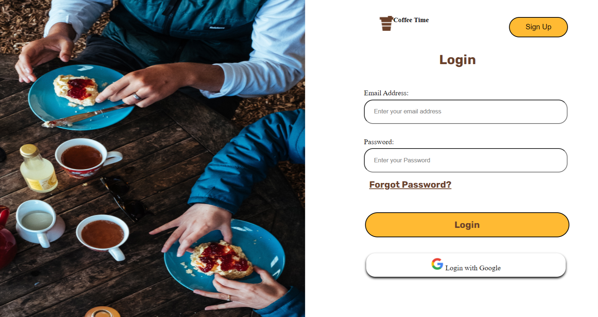
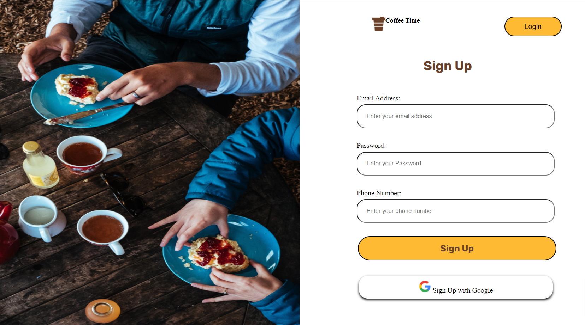
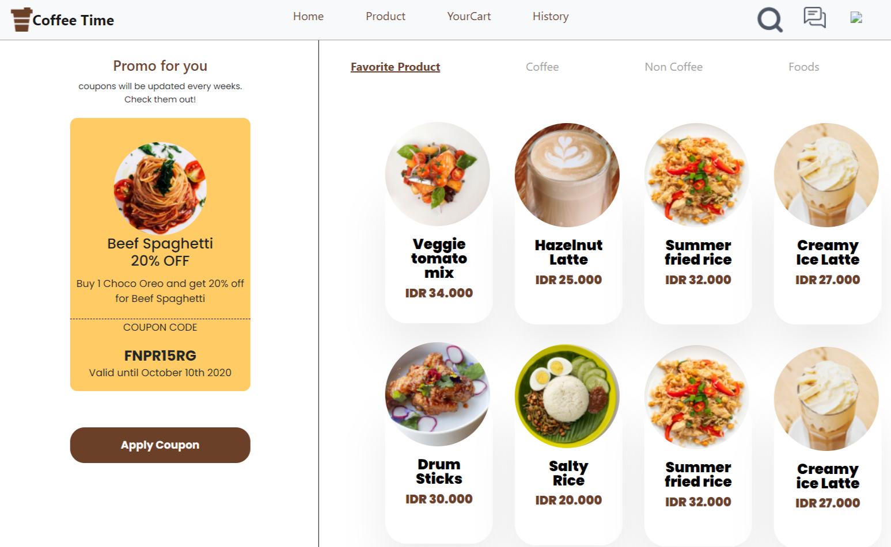

## Built With

- `HTML`
- `CSS`
- `Bootstraps`

 

## Website

- [ ``√`` ] `Home Page`
- [ ``√`` ] `Home Sign-Up`
- [ ``√`` ] `Home Login`
- [ ``√`` ] `Home Product`
- [ ``√`` ] `Home Profile`

 

## Contact

Rofiq Hidayat - [@roef_kr/\_\_](https://www.instagram.com/roef_kr/) - rofiqhidayat495@gmail.com

 

## Deploy Website

Link Website : https://coffeetimenew.netlify.app/

 

## Github

Project Link: https://github.com/rofiq999/Coffee-Time-Frond-End

 

## User Interface Website

1. Home Page
 
 

 

2. Login
 
 

 

3. Sign Up
 
 

 

4. Profile
 
 

 

5. product
 
 

