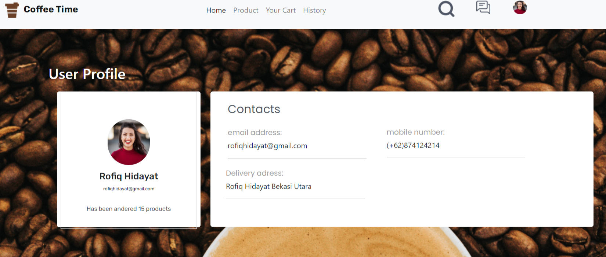

<div align="center">
  <h2><u>Coffee Time </u></h2>
</div>

<br>
<br>

# About The Project

<p>Coffee Time is everyone can drinks</p>

<h2 align="left">Built With</h2>

<p align="left">
  <a href="https://skillicons.dev">
    
  </a>
</p>

<!-- GETTING STARTED -->

# Getting Started

1. Download this Project or you can type
   `https://github.com/rofiq999/Coffee_time-Frond-End/archive/refs/heads/master.zip`
2. Open IDE or Click index.html
3. Coffee Time is Running

## Installation

1. Clone the repo

   ```sh
   git clone https://github.com/rofiq999/Coffee-Time-Frond-End.git
   ```

2. Open IDE or Click index.html
3. Coffee Time is Running

## Features

1. Responsive
2. Perfomance Testing with Lighthouse
3. HTML and CSS only
   <br>

## User Interface Website

<hr>
<div align="center">
1. Home Page
<br>
<br>

<div>

<br>
<div align="center">
2. Login
<br>
<br>

<div>

<br>
<div align="center">
3. Sign Up
<br>
<br>

<div>

<br>
<div align="center">
4. Profile
<br>
<br>

<div>

<br>
<div align="center">
5. product
<br>
<br>

<div>

<br>

<h2 align="left">Related Project<h4>
<p align="left"> Frontend Deploy [`here`] ( https://coffeetimenew.netlify.app/)</p>
<a align="left"> Link Website : https://coffeetimenew.netlify.app <a>
<p align="center"><sub><b>&copy;2022❤️Coffee TIme☕</b></sub> </p>
